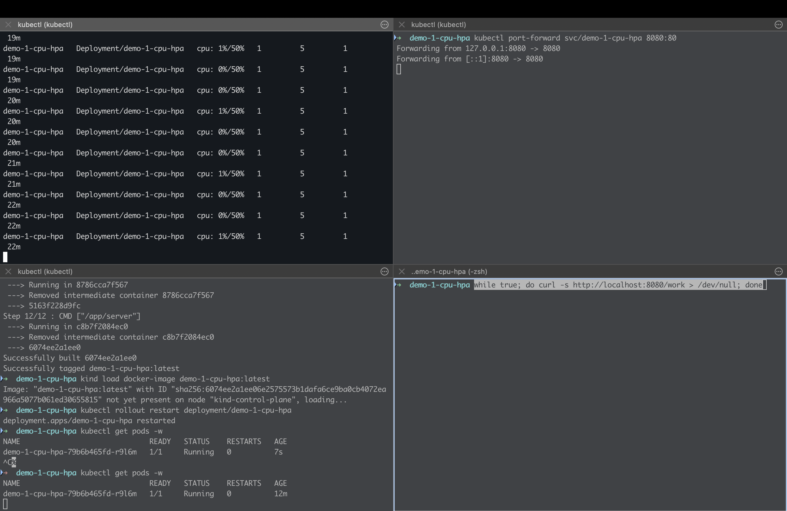
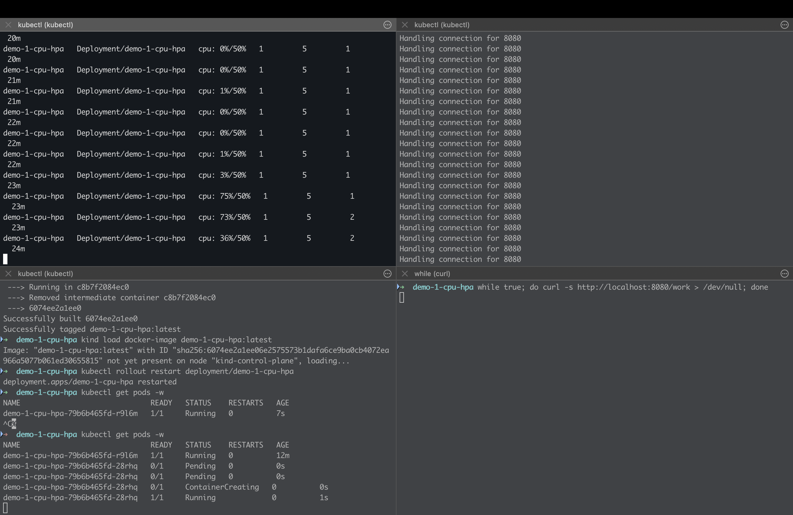
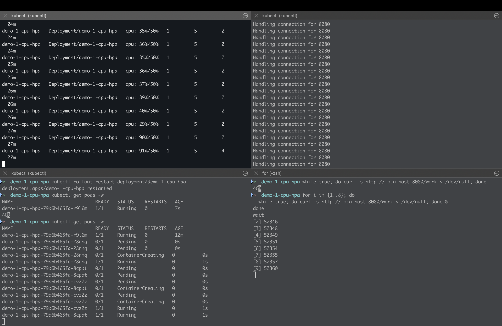
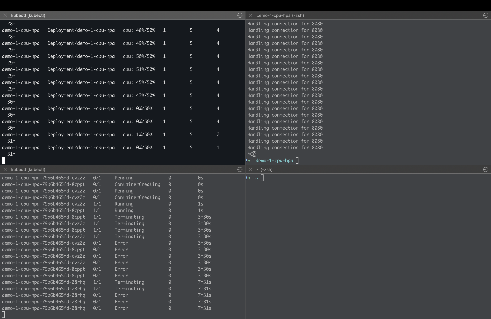

# Kubernetes Autoscaling Patterns Demo

[](https://github.com/samuelhajnik/k8s-autoscaling-patterns-demo/actions/workflows/ci.yml)

This repository demonstrates two different Kubernetes autoscaling strategies and the trade-offs behind them:

- **CPU-based autoscaling with HPA**
- **Lag-based autoscaling with KEDA**

The goal is not only to show how autoscaling can be configured. The goal is to show that autoscaling behavior depends on choosing the right signal for the workload.

A scaling signal that works well for one system can be misleading for another.

## What This Repo Demonstrates

This project compares two fundamentally different workload patterns:

| Workload Type | Example | Scaling Signal | Autoscaler |
|--------------|---------|----------------|------------|
| Synchronous request/response | HTTP API | CPU utilization | Kubernetes HPA |
| Asynchronous event processing | Message consumer | Queue lag / backlog | KEDA |

The main lesson is that autoscaling is not a generic Kubernetes feature that can be applied the same way everywhere.

Autoscaling is a system design decision. The autoscaler can only react to the signal it is given. If the signal does not represent real system pressure, scaling behavior will be incorrect.

---

## Why This Matters

Autoscaling is often treated as a configuration problem:

> Set CPU target, define min/max replicas, apply YAML, done.

That works only when the chosen metric actually represents load.

For synchronous services, CPU can be a useful signal because incoming requests often translate directly into compute pressure. More requests usually mean more CPU usage, and additional pods can help reduce per-pod pressure.

For asynchronous systems, CPU may not tell the full story. A consumer can have low CPU usage while the queue backlog keeps growing. In that case, the system is under pressure even if the CPU metric looks healthy.

This repo demonstrates that choosing the wrong scaling signal can lead to:

- under-scaling
- over-scaling
- growing backlog
- misleading resource metrics
- poor latency under load
- false confidence in autoscaler configuration

---

## The Two Demos

### Demo 1 — CPU-based autoscaling with HPA

**Workload**

A synchronous HTTP service receives requests and processes work inline.

**Scaling signal**

CPU utilization.

**Autoscaler**

Kubernetes Horizontal Pod Autoscaler.

**Expected behavior**

When request volume increases and CPU usage rises, HPA increases the number of pods. When load drops, the deployment scales down again.

This works well when CPU usage is a good proxy for system pressure.

**Trade-off**

CPU-based scaling is simple and widely supported, but it is reactive. It responds to resource usage after pressure appears. It also assumes that CPU usage is the right representation of demand.

That assumption is valid for many compute-bound services, but not for all systems.

---

### Demo 2 — Lag-based autoscaling with KEDA

**Workload**

A producer publishes messages and consumers process them asynchronously.

**Scaling signal**

Queue lag / backlog.

**Autoscaler**

KEDA.

**Expected behavior**

When the backlog grows, KEDA increases the number of consumer pods. As consumers drain the backlog, the deployment scales down.

This works well when queue depth or consumer lag reflects the real pressure in the system.

**Trade-off**

Lag-based scaling is better aligned with asynchronous workloads, but it is not instant. The system intentionally allows buffering. This can improve throughput and resilience, but it may also increase processing latency.

Lag-based scaling also depends heavily on consumer design, partitioning, message processing time, and downstream capacity.

---

## Quick Start — Reviewer Path

Use this path when reviewing the repository quickly:

1. Run the CPU-based HPA demo.
2. Observe pod scaling under synchronous load.
3. Run the lag-based KEDA demo.
4. Observe backlog growth and consumer scaling.
5. Compare the behavior of both systems.

Focus on these questions:

- What signal is the autoscaler watching?
- Does that signal reflect real pressure?
- When does scaling start?
- Does adding replicas actually improve throughput?
- What limits further scaling?

---

## What You Should Observe

### CPU-based scaling

CPU-based HPA reacts to current compute pressure.

You should observe:

- pods scale up when CPU usage increases
- scaling stabilizes when average CPU usage reaches the target range
- pods scale down after load decreases
- behavior is tied to resource usage, not queue depth or delayed work

This is suitable when the workload is synchronous and CPU-bound.

### Lag-based scaling

Lag-based KEDA scaling reacts to accumulated work.

You should observe:

- backlog grows when producers outpace consumers
- consumers scale out as lag increases
- backlog drains as processing capacity increases
- consumers scale down after the queue is caught up

This is suitable when work is asynchronous and the queue represents system pressure.

---

## Demo Behavior

### CPU HPA

Steady state, initial scale-up, plateau as CPU averages out, further scale-up under sustained load, and scale-down when load drops.









---

### Lag / Backlog Scaling

Low backlog initially, then scale-out as lag grows, followed by scale-down after backlog is drained.


---

## Key Trade-offs and Lessons

### 1. CPU is not a universal scaling signal

CPU works well when the workload is compute-bound and request volume directly increases CPU usage.

It works less well when the real pressure is somewhere else: queue backlog, downstream latency, external API limits, database contention, memory pressure, or I/O wait.

In asynchronous systems, a consumer can look healthy from a CPU perspective while messages accumulate faster than they are processed.

The trade-off is simplicity vs accuracy. CPU metrics are easy to use, but they may not represent the actual business or processing pressure of the system.

---

### 2. Lag reflects accumulated pressure

Queue lag is often a better signal for event-driven systems because it measures unfinished work.

If producers generate messages faster than consumers process them, lag increases. That backlog is the actual pressure the system needs to respond to.

The trade-off is that lag-based scaling accepts buffering as part of the design. This can improve resilience and throughput, but it means that some work may wait before being processed.

Lag-based scaling is therefore usually a better fit for throughput-oriented systems than for ultra-low-latency paths.

---

### 3. Autoscaling cannot exceed architectural limits

Adding more pods does not always increase throughput.

In event-driven systems, scaling is often limited by:

- number of partitions
- hot keys or hot partitions
- downstream database capacity
- message processing time
- external API rate limits
- locking or shared state
- inefficient consumer logic

For example, if a topic has only three partitions, scaling to ten consumer pods may not improve throughput. Some consumers will remain idle because there are not enough partitions to assign.

The trade-off is that autoscaling improves capacity only when the architecture allows parallelism.

---

### 4. Partitioning shapes scalability

Partitioning is one of the most important design decisions in event-driven systems.

Good partitioning allows work to be distributed across consumers. Poor partitioning creates bottlenecks, even when more pods are available.

A hot partition can limit the whole pipeline. If many messages are routed to the same partition, only one consumer may be able to process that partition at a time.

The trade-off is ordering vs parallelism. Partitioning by key can preserve ordering for that key, but it can also limit how much the system can scale.

---

### 5. Latency and throughput are different goals

CPU-based scaling is often associated with reducing request latency for synchronous services.

Lag-based scaling is often associated with increasing throughput for asynchronous processing.

These are related, but they are not the same. A system can have high throughput while individual messages wait in a queue. A system can also have low latency for individual requests while being inefficient under sustained load.

The trade-off is whether the system optimizes for immediate response time, efficient batch processing, backlog recovery, or predictable processing delay.

---

### 6. Autoscaler configuration cannot fix poor system design

Autoscaler settings matter, but they are not enough.

Thresholds, cooldown periods, min/max replicas, and polling intervals can tune behavior, but they cannot fix the wrong architecture.

If the signal is wrong, scaling will be wrong. If the workload cannot be parallelized, adding replicas will not help. If the downstream system is the bottleneck, scaling consumers may only move the pressure somewhere else.

The trade-off is that autoscaling must be designed together with workload shape, partitioning, backpressure, and downstream capacity.

---

## Architecture Overview

### Demo 1 — CPU-based HPA

```text
Client load
   |
   v
Go HTTP service
   |
   v
CPU utilization increases
   |
   v
Horizontal Pod Autoscaler
   |
   v
More service pods
```

The service processes requests inline. Scaling is based on CPU utilization.

This model works best when request load and CPU pressure are closely related.

---

### Demo 2 — Lag-based KEDA scaling

```text
Producer
   |
   v
Message broker / stream
   |
   v
Consumer group
   |
   v
Backlog / lag changes
   |
   v
KEDA ScaledObject
   |
   v
More consumer pods
```

The producer and consumers are decoupled by the queue. Scaling is based on backlog rather than CPU.

This model works best when the queue represents unfinished work and consumers can process that work in parallel.

---

## How to Get Started

Use a local Kubernetes environment, such as `kind`.

Run the CPU-based demo:

```bash
cd demo-1-cpu-hpa
```

Run the lag-based demo:

```bash
cd demo-2-redpanda-keda
```

Then compare scaling behavior under load.

---

## Observability

You can verify behavior using simple tools:

```bash
kubectl get pods
kubectl get hpa
kubectl describe scaledobject
```

For the async demo, also inspect consumer logs and backlog behavior.

The goal is to keep system behavior visible during the demo. Autoscaling should not be treated as a black box.

---

## How This Maps to Real Systems

These patterns appear in production systems such as:

- synchronous APIs
- payment processing systems
- notification platforms
- Kafka or Redpanda consumers
- batch ingestion pipelines
- ClickHouse or analytics ingestion
- background job workers
- event-driven microservices

The same design questions appear repeatedly:

- What metric actually represents pressure?
- Is the workload synchronous or asynchronous?
- Is the system CPU-bound, I/O-bound, or backlog-bound?
- Can work be processed in parallel?
- What limits consumer throughput?
- Does scaling reduce latency, increase throughput, or just move the bottleneck?

---

## Production Considerations

A production implementation would usually require:

- meaningful service-level objectives
- separate metrics for latency, throughput, error rate, and backlog
- clear min/max replica limits
- cooldown and stabilization settings
- alerting for sustained backlog growth
- partitioning strategy aligned with ordering requirements
- consumer lag monitoring
- downstream capacity protection
- backpressure strategy
- load testing under realistic traffic patterns
- scale-down behavior validation

Autoscaling should be tested under failure and sustained load, not only under short artificial spikes.

---

## Repo Structure

```text
k8s-autoscaling-patterns-demo/
  README.md
  docs/
    screenshots/
  demo-1-cpu-hpa/
  demo-2-redpanda-keda/
```

---

## CI

GitHub Actions runs on pushes and pull requests to `main`.

The workflow validates the demo manifests with `yamllint`, `kubeconform`, and a lightweight consistency check for HPA, Service, and KEDA references.

## Summary

This demo highlights a core distributed systems principle:

> Autoscaling is not about Kubernetes configuration. It is about choosing the correct signal for your system.

CPU-based scaling works well when resource usage reflects current pressure. Lag-based scaling works better when unfinished work is buffered in a queue and backlog represents the real pressure.

The main lesson is that autoscaling is constrained by system design. The right autoscaler configuration cannot compensate for the wrong signal, poor partitioning, limited downstream capacity, or a workload that cannot be parallelized.

Reliable autoscaling starts with understanding the workload: what creates pressure, what limits throughput, and what signal best represents the system’s actual need for more capacity.

