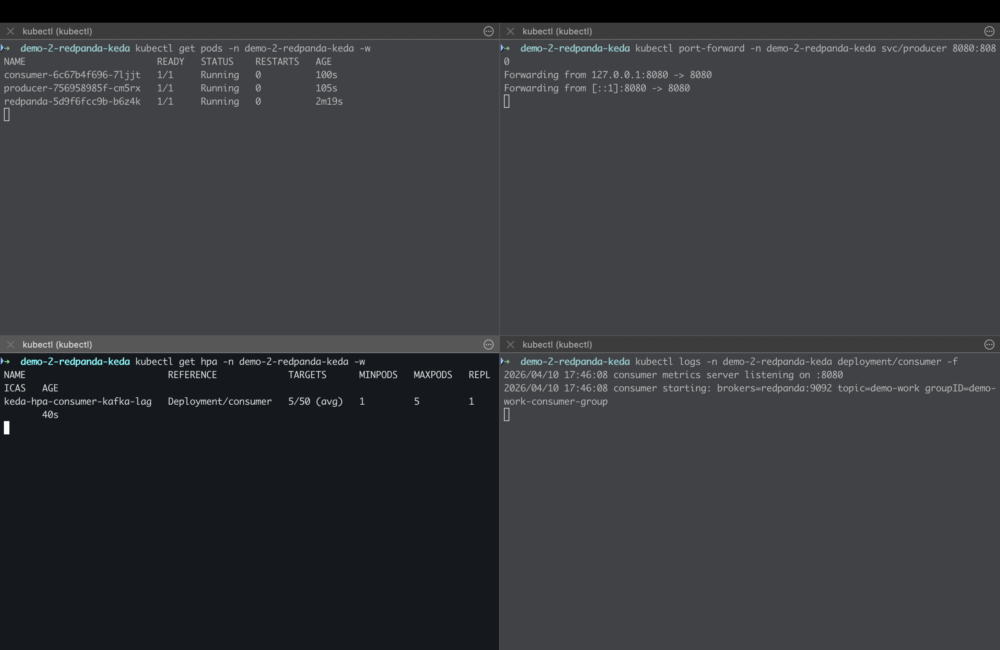
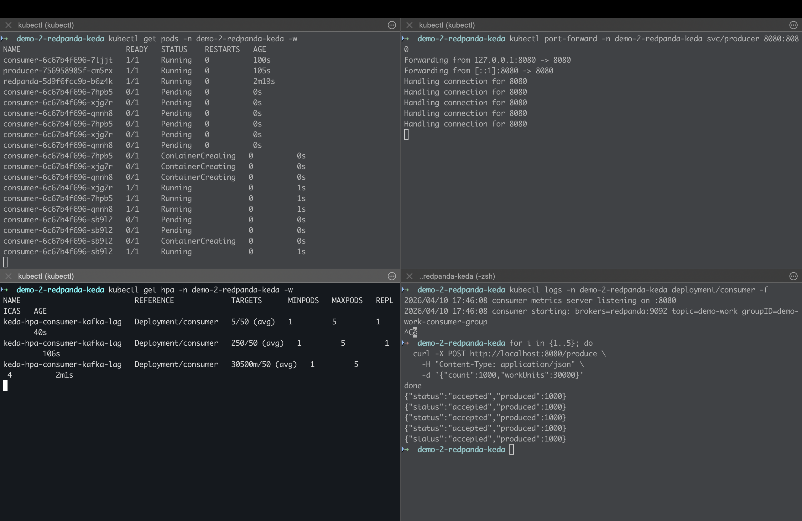
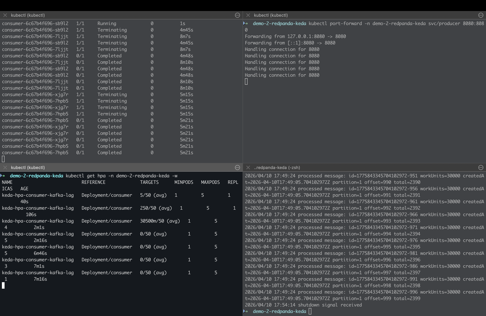

# Demo 2: Redpanda + KEDA Lag-Based Autoscaling

## 1) Overview

This demo models an asynchronous, event-driven workload on Kubernetes:

- a producer publishes messages
- a consumer processes messages
- KEDA scales the `consumer` deployment based on lag (backlog)

It is designed to contrast with CPU-based autoscaling (Demo 1) and demonstrate how backlog-driven scaling behaves in practice.

---

## 2) Key Idea

**Autoscaling should follow real workload pressure, not just convenient signals like CPU.**

In asynchronous systems, pressure typically appears as **backlog (lag)** rather than CPU.

- CPU → how busy the service is  
- Lag → whether the system is keeping up with incoming work  

This demo uses lag as the scaling signal because it directly reflects end-to-end processing delay.

---

## 3) Architecture

```text
Load (HTTP /produce)
        |
        v
Producer service
        |
        v
Redpanda topic: demo-work (5 partitions)
        |
        v
Consumer deployment (group: demo-work-consumer-group)
        |
        v
KEDA Kafka trigger (lag) -> HPA -> consumer replicas
```

Namespace: `demo-2-redpanda-keda`  
Broker DNS: `redpanda.demo-2-redpanda-keda.svc.cluster.local:9092`

---

## 4) Components

- Redpanda (Kafka-compatible broker)
- Producer service
- Consumer service
- KEDA ScaledObject (Kafka trigger)
- Kubernetes Deployment + HPA

Topic setup:

- Topic: `demo-work`
- Consumer group: `demo-work-consumer-group`
- Partitions: `5`

### App tests

From the repository root, `./scripts/test-apps.sh` runs `go test` and `go vet` for both demos. From this directory you can run `go test ./...`; producer and consumer tests use fakes and do not require Redpanda or KEDA.

---

## 5) Why Lag Is the Scaling Signal

For queue-driven systems:

- Work accumulates in the broker before consumers show high CPU
- CPU reacts late to pressure
- Lag reflects **real backlog and delay**

This makes lag a more accurate signal for scaling consumer fleets.

---

## 6) Partition-Constrained Scaling (Important)

Consumer parallelism is bounded by partition count:

- each partition can be consumed by only one consumer at a time
- adding consumers beyond partition count does not increase throughput

This is a common real-world limitation in Kafka-based systems.

This means:

> Autoscaling effectiveness is constrained by system design, not just autoscaler configuration.

---

## 7) How to Run (kind + KEDA)

### Install KEDA

```bash
helm repo add kedacore https://kedacore.github.io/charts
helm repo update
kubectl create namespace keda
helm install keda kedacore/keda --namespace keda
```

### Deploy system

```bash
kubectl apply -f k8s/namespace.yaml
kubectl apply -f k8s/redpanda-deployment.yaml
kubectl apply -f k8s/redpanda-service.yaml

docker build -f Dockerfile.producer -t demo-2-producer:latest .
docker build -f Dockerfile.consumer -t demo-2-consumer:latest .
kind load docker-image demo-2-producer:latest
kind load docker-image demo-2-consumer:latest

kubectl apply -f k8s/producer-deployment.yaml
kubectl apply -f k8s/producer-service.yaml
kubectl apply -f k8s/consumer-deployment.yaml
kubectl apply -f k8s/keda-scaledobject.yaml
```

---

## 8) Create Topic

```bash
kubectl exec -n demo-2-redpanda-keda -it deploy/redpanda -- sh -c \
  "rpk topic create demo-work --partitions 5 --brokers redpanda:9092"
```

---

## 9) Validate Scaling

### Generate load

```bash
kubectl port-forward -n demo-2-redpanda-keda svc/producer 8080:8080
```

```bash
for i in {1..5}; do
  curl -X POST http://localhost:8080/produce \
    -H "Content-Type: application/json" \
    -d '{"count":1000,"workUnits":30000}'
done
```

### Observe scaling

```bash
kubectl get hpa -n demo-2-redpanda-keda -w
kubectl get deploy consumer -n demo-2-redpanda-keda -w
```

Expected behavior:

- backlog grows → scale up
- backlog drains → scale down (delayed)
- scaling is driven by lag, not CPU

---

### Scaling Behavior (Snapshots)

Scaling is driven by lag (backlog), which reflects whether the system is keeping up with incoming work.

Low backlog at the start, then scale-out as consumer lag grows (the system is falling behind).  
After the backlog is drained, the system scales down.  
Scale-down typically lags scale-up due to cooldown periods and HPA/KEDA stabilization behavior.





---

## 10) Observability

Simple signals are sufficient:

- `kubectl get pods`
- `kubectl get hpa`
- `kubectl describe scaledobject`
- consumer logs

These allow reasoning about backlog, scaling, and recovery behavior without full dashboards.

---

## 11) What I Observed

- lag-based scaling reacts directly to backlog growth
- CPU alone would not capture this pressure early enough
- scaling improves throughput until partition limits are reached
- beyond partition limit, additional replicas provide no benefit

---

## 12) Operational Trade-offs

Lag-based autoscaling improves responsiveness to real workload pressure.

However:

- depends on correct broker/topic configuration
- constrained by partition count
- adds complexity compared to CPU-based HPA

Choosing lag vs CPU is a **design decision**, not just configuration.

---

## 13) What I Learned

- backlog is often the correct signal for asynchronous systems
- autoscaling effectiveness depends on system architecture
- partitioning directly impacts scalability limits
- KEDA + Kafka integration requires correct wiring (broker, topic, group)
- scaling is responsive but not instantaneous due to control-loop timing

---

This demo is a focused learning setup, not a production-ready system.
