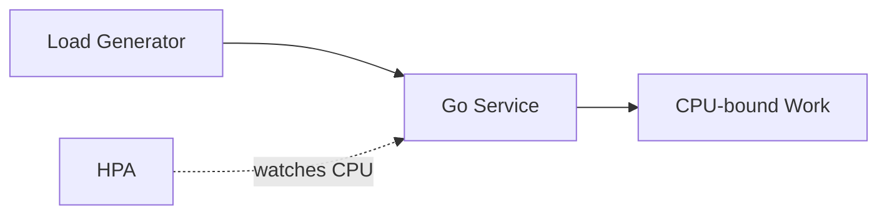

# Demo 1: CPU-Based HPA Flow

This demo models a synchronous request path.
Load is sent directly to the Go service, which performs CPU-heavy work inline.
HPA observes CPU utilization and adjusts replica count over time.
The signal is simple and native to Kubernetes for stateless compute-heavy services.
