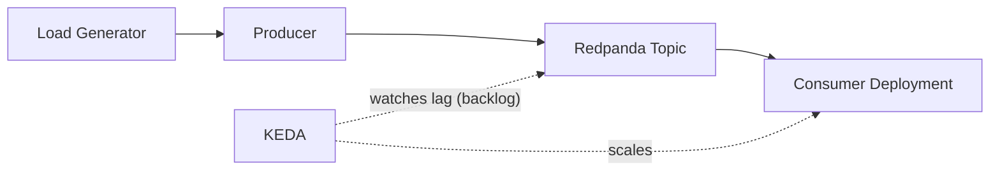

# Demo 2: Redpanda + KEDA Lag Flow

This demo models an asynchronous event-driven pipeline.
Producer traffic creates queued work in Redpanda, then consumers drain the backlog.
KEDA watches lag (backlog) and scales the consumer deployment accordingly.
For queue-driven systems, lag is often a stronger scaling signal than CPU.
